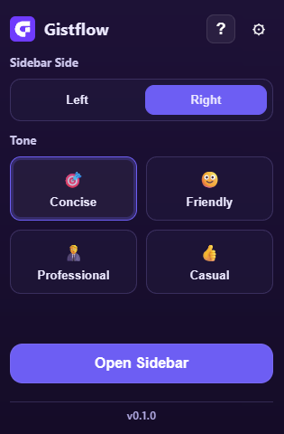
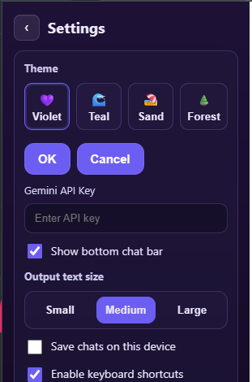
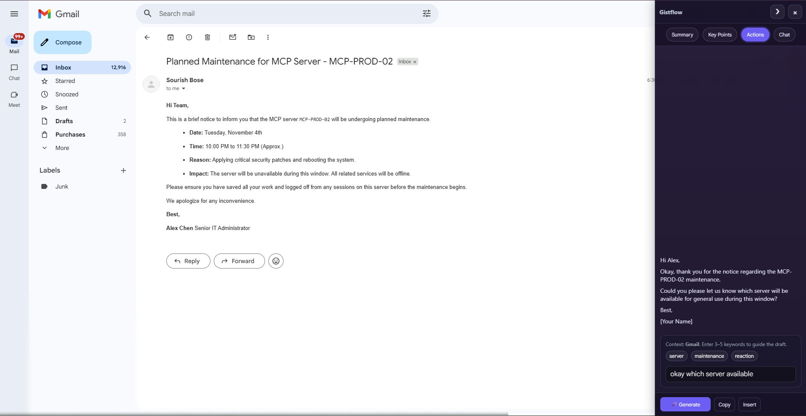
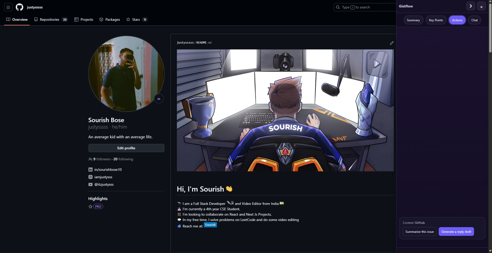
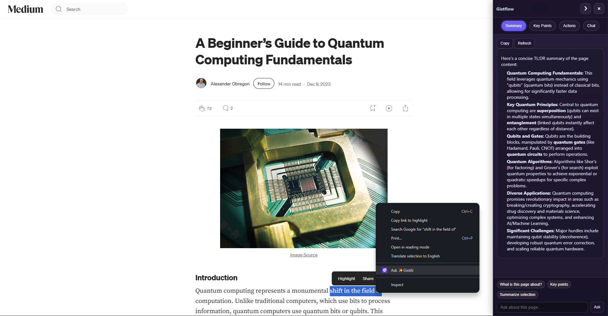

<p align="center">
  
</p>

# Gistflow

Get the gist, find your flow.

<!-- Badges -->
[](https://github.com/justysssss/GistFlow/releases)
[](LICENSE)
[](#)

Gistflow is an on‑page AI sidebar for Chrome that understands the site you’re on. Summarize pages and videos, pull key points, draft Gmail replies, review GitHub issues/PRs, and chat with the page—without leaving your flow.

<p align="center">
  
</p>

> Works with Chrome’s built‑in AI when available. Falls back to Gemini with your API key.

---

## Feature tour

### 1) Quick popup

<p align="center">
  
</p>

- Pick where the sidebar lives (Left/Right)
- Choose a tone (Concise, Friendly, Professional, Casual)
- One click “Open Sidebar” to start
- Version label at the bottom for quick checks

### 2) Settings you’ll actually use

<p align="center">
  
</p>

- Gemini API key (used only if on‑device AI isn’t available)
- Show bottom chat bar on non‑Chat tabs
- Output text size (S/M/L) and theme (Violet/Teal/Sand/Forest)
- Save chats on this device, enable keyboard shortcuts
- Autostart on this site

### 3) Gmail actions: write it for me

<p align="center">
  
</p>

- Keyword chips → 🪄 Generate a reply draft in your tone
- Copy or Insert directly into Gmail’s composer
- Output appears above the composer area for less scrolling

### 4) GitHub actions: summarize and draft replies

<p align="center">
  
</p>

- Summarize issues/PR discussions
- Draft a review/reply with intent and key points
- Copy/Insert into the comment box

### 5) Read mode (docs/articles)

<p align="center">
  
</p>

- Summary and Key Points stay in sync with what you’re reading
- Background completion + per‑URL cache (results are ready when you return)
- Refresh button to recompute when the page changes

### 6) YouTube: lectures, talks, and tutorials

<p align="center">
  
</p>

- Summarize long videos and extract actionable key takeaways
- Key Points font scales correctly on YouTube (no shrinking)
- Chat with the video page to clarify concepts

---

## Features

- On‑page AI sidebar with four tabs: Summary, Key Points, Actions, Chat
- Site‑aware Actions:
  - Gmail: keyword chips → 🪄 Generate → Copy/Insert into composer
  - GitHub: summarize issues/PRs, draft review/reply
  - Docs/StackOverflow: extract code, explain simply, make step‑by‑step
  - Shopping: pros/cons from reviews, extract specs
  - YouTube: summarize lectures and pull key takeaways
- Background completion + per‑URL cache for Summary/Key Points (results wait for you)
- Always‑available Chat composer on the Chat tab
- Polished UX: themes (Violet/Teal/Sand/Forest), tone presets, output text size (S/M/L)
- Keyboard shortcuts (Alt+S/C/L), optional chat/history persistence

---

## Install (developer)

1) Clone and install

```powershell
git clone <your-repo-url>
cd gistflow-ext
npm ci
```

2) Build

```powershell
npm run build
```

3) Load in Chrome (Load unpacked)

- Open chrome://extensions
- Enable “Developer mode” (top right)
- Click “Load unpacked” and select the dist folder
- Pin the extension if you like; click the icon → “Open Sidebar”

Optional: Zip for sharing

```powershell
Compress-Archive -Path dist\* -DestinationPath gistflow-ext.zip
```

---

## How to use

- Open any page (Gmail, GitHub, docs, articles, YouTube)
- Click the extension icon → “Open Sidebar” (or press Alt+S)
- Use tabs:
  - Summary: quick overview of the page
  - Key Points: checklist of takeaways you can copy
  - Actions: site‑specific helpers (e.g., Gmail draft, GitHub reply)
  - Chat: ask anything about the current page
- Shortcuts: Alt+S (toggle), Alt+C (Chat), Alt+L (left/right)

---

## AI setup (no backend)

Gistflow prefers Chrome’s on‑device AI (when available). If your browser doesn’t expose it yet, add a Gemini API key:

- Open the popup → Settings → “Gemini API Key” → paste key → Save
- We call Google Generative Language API (Gemini) from the extension

No key? If your Chrome has built‑in AI enabled, Gistflow will use it automatically.

---

## Privacy

- No servers, no analytics—everything runs in your browser
- Only trimmed, visible text is sent when using cloud models
- Settings sync via chrome.storage.sync; summaries/history cache in chrome.storage.local

---

## Tech

- Chrome MV3, TypeScript, Vite, React (popup)
- Content script UI (vanilla), minimal markdown renderer
- Chrome APIs: storage, scripting, tabs, runtime, clipboard, activeTab
- AI: Chrome on‑device (when available), Gemini fallback via REST

---

## License

MIT © You
